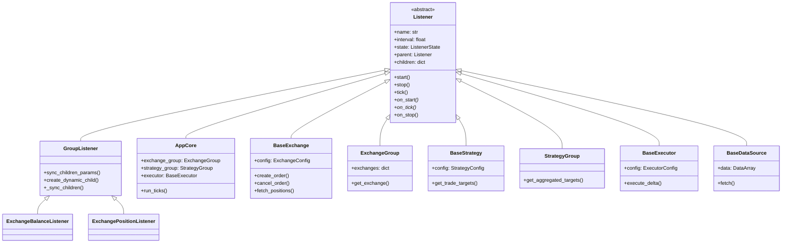
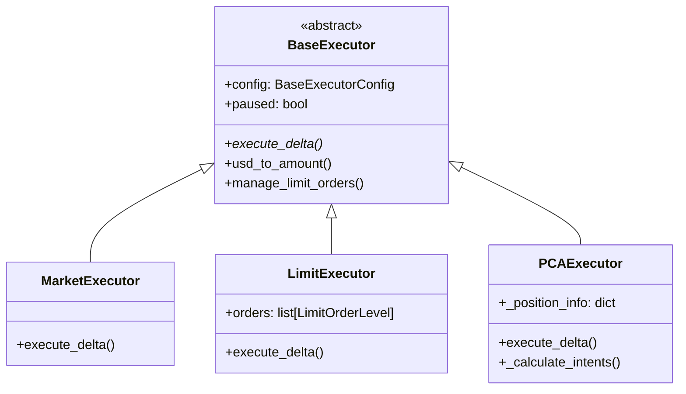
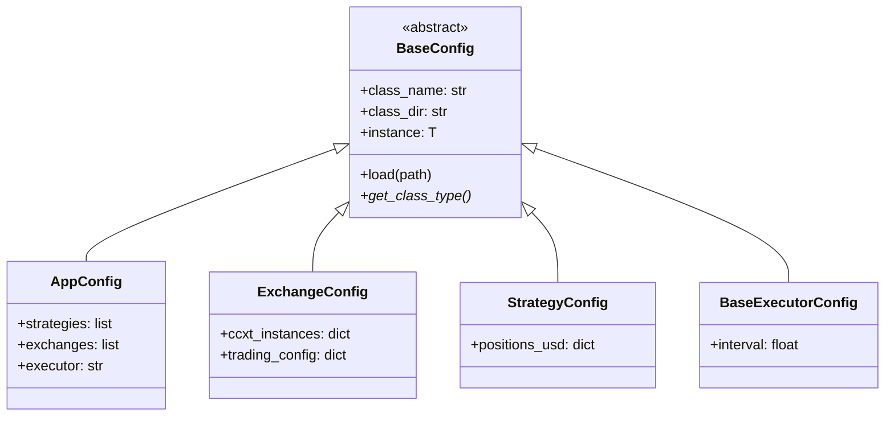

# HFT-Python 架构文档

## 项目概述

HFT-Python 是一个高频交易框架，基于 Listener 树形架构实现统一的生命周期管理。

## 相关文档

| 文档 | 内容 |
|------|------|
| [listener.md](listener.md) | Listener 状态机、生命周期、类索引、GroupListener |
| [executor.md](executor.md) | 执行器：Market、Limit、PCA |
| [exchange.md](exchange.md) | 交易所封装、子监听器 |
| [datasource.md](datasource.md) | 数据源三层架构、按需创建、自动销毁 |
| [indicator.md](indicator.md) | 指标模块：事件驱动、轮询驱动、TradeIntensity |
| [database.md](database.md) | 数据缓存、Watch/Fetch、ClickHouse 持久化 |
| [plugin.md](plugin.md) | 插件系统：Hooks、扩展点、内置插件 |

## 核心模块

```
hft/
├── core/           # 核心模块
│   ├── listener.py     # Listener 基类和 GroupListener
│   ├── healthy_data.py # 健康数据管理
│   └── app/            # 应用核心
│       ├── base.py         # AppCore 主应用
│       ├── config.py       # 应用配置
│       └── listeners.py    # 状态日志等监听器
│
├── config/         # 配置系统
│   ├── base.py         # BaseConfig 基类
│   └── crypto.py       # 加密工具
│
├── exchange/       # 交易所模块
│   ├── base.py         # BaseExchange 基类
│   ├── group.py        # ExchangeGroup 多账户管理
│   ├── config.py       # 交易所配置
│   ├── listeners.py    # 余额/持仓/订单监听器
│   ├── okx/            # OKX 交易所实现
│   └── binance/        # Binance 交易所实现
│
├── strategy/       # 策略模块
│   ├── base.py         # BaseStrategy 基类
│   └── group.py        # StrategyGroup 策略聚合
│
├── executor/       # 执行器模块
│   ├── base.py         # BaseExecutor 基类
│   ├── config.py       # 执行器配置
│   ├── market.py       # 市价单执行器
│   ├── limit.py        # 限价单执行器
│   └── pca.py          # PCA (马丁格尔) 执行器
│
├── datasource/     # 数据源模块（三层架构）
│   ├── base.py         # BaseDataSource 基类
│   ├── group.py        # DataSourceGroup + TradingPairDataSource
│   ├── ticker.py       # Ticker 数据源
│   ├── orderbook.py    # OrderBook 数据源
│   ├── trades.py       # Trades 数据源
│   └── ohlcv.py        # OHLCV 数据源
│
├── indicator/      # 指标模块
│   ├── base.py         # BaseIndicator 事件驱动指标
│   ├── lazy.py         # LazyIndicator 轮询指标
│   └── intensity.py    # TradeIntensityIndicator
│
└── database/       # 数据库模块
    ├── client.py       # ClickHouse 客户端和 Controllers
    └── listeners.py    # DataListener 基类
```

## 类图

### Listener 继承体系



### 执行器继承体系



### 配置系统



## 数据流

```
┌──────────────┐    ┌──────────────┐    ┌──────────────┐
│  DataSource  │───>│   Strategy   │───>│   Executor   │
│  (市场数据)   │    │  (计算目标)   │    │  (执行交易)   │
└──────────────┘    └──────────────┘    └──────────────┘
       │                   │                    │
       │                   │                    │
       v                   v                    v
┌──────────────────────────────────────────────────────┐
│                    Exchange                           │
│              (交易所 API 封装)                         │
└──────────────────────────────────────────────────────┘
```

## Listener 状态机

```
STOPPED ──start()──> STARTING ──tick()──> RUNNING
   ^                                         │
   │                                         │
   └────stop()────── STOPPING <──tick()──────┘
```

## 生命周期

1. **初始化**：AppCore 创建，加载配置，构建 Listener 树
2. **启动**：递归调用 `start()`，状态转为 STARTING
3. **运行**：循环调用 `tick()`，状态转为 RUNNING
4. **停止**：递归调用 `stop()`，状态转为 STOPPED

## 配置加载流程

```
conf/app/main.yaml
        │
        v
   AppConfig.load()
        │
        ├──> strategies: [keep_positions/main]
        │         └──> StrategyConfig.load() ──> BaseStrategy 实例
        │
        ├──> exchanges: [okx/demo]
        │         └──> ExchangeConfig.load() ──> BaseExchange 实例
        │
        └──> executor: market/default
                  └──> ExecutorConfig.load() ──> BaseExecutor 实例
```
