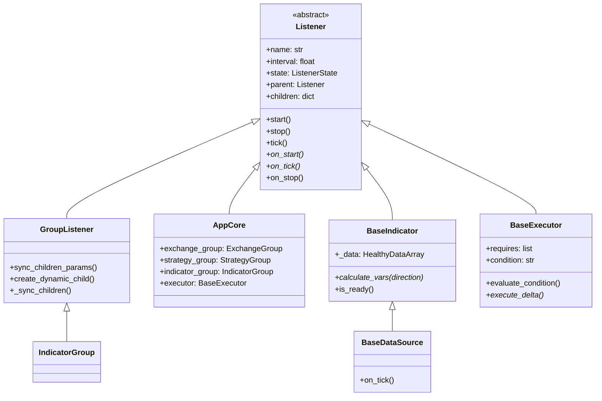
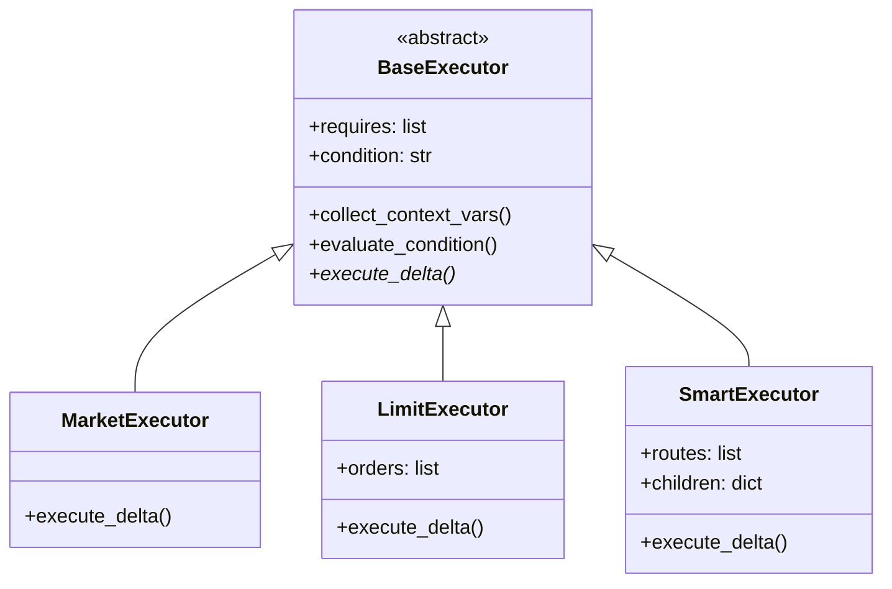
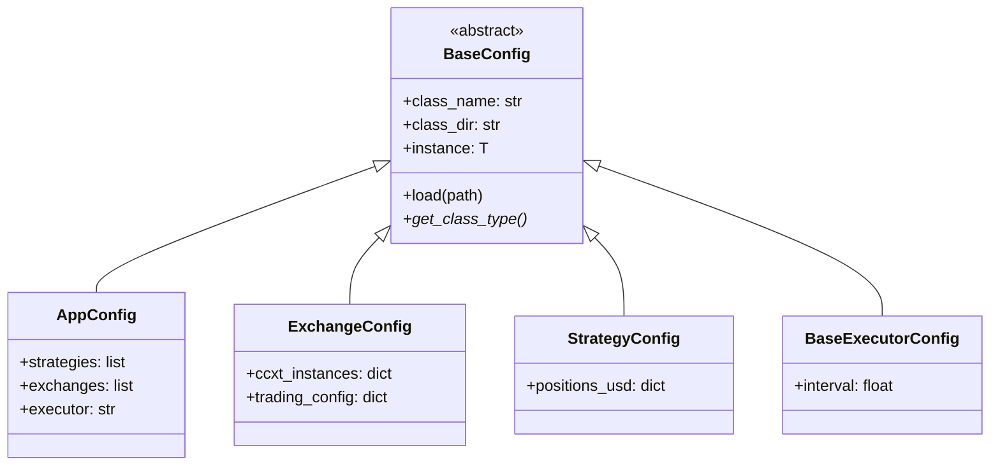

# HFT-Python 架构文档

## 项目概述

HFT-Python 是一个高频交易框架，采用**数据驱动**的执行架构，基于 Listener 树形结构实现统一的生命周期管理。

### 核心设计理念

1. **Indicator 统一架构**：DataSource 是特殊的 Indicator，统一通过 `IndicatorGroup` 管理
2. **数据驱动执行**：Indicator 提供变量，Executor 通过表达式动态决策
3. **组合模式**：Strategy 定义目标 + Executor 定义执行方式，自由组合

## 相关文档

| 文档 | 内容 |
|------|------|
| [listener.md](listener.md) | Listener 状态机、生命周期、GroupListener |
| [executor.md](executor.md) | 执行器：Market、Limit、Smart、数据驱动设计 |
| [exchange.md](exchange.md) | 交易所封装、子监听器 |
| [datasource.md](datasource.md) | 数据源（特殊的 Indicator） |
| [indicator.md](indicator.md) | 指标模块：DataSource、Computed Indicator |
| [database.md](database.md) | ClickHouse 持久化 |
| [plugin.md](plugin.md) | 插件系统：Hooks、扩展点 |

## 核心模块

```
hft/
├── core/           # 核心模块
│   ├── listener.py     # Listener 基类和 GroupListener
│   ├── healthy_data.py # HealthyDataArray 健康数据管理
│   └── app/            # 应用核心
│       ├── base.py         # AppCore 主应用
│       └── config.py       # 应用配置
│
├── config/         # 配置系统
│   ├── base.py         # BaseConfig 基类
│   └── crypto.py       # 加密工具
│
├── exchange/       # 交易所模块
│   ├── base.py         # BaseExchange 基类
│   ├── group.py        # ExchangeGroup 多账户管理
│   └── listeners.py    # 余额/持仓/订单监听器
│
├── strategy/       # 策略模块
│   ├── base.py         # BaseStrategy 基类
│   └── group.py        # StrategyGroup 策略聚合
│
├── executor/       # 执行器模块
│   ├── base.py         # BaseExecutor 基类（数据驱动）
│   ├── market_executor/    # 市价单执行器
│   ├── limit_executor/     # 限价单执行器
│   └── smart_executor/     # 智能路由执行器
│
├── indicator/      # 指标模块（统一架构）
│   ├── base.py         # BaseIndicator, BaseDataSource
│   ├── group.py        # IndicatorGroup, TradingPairIndicators
│   ├── factory.py      # IndicatorFactory 注册表
│   ├── datasource/     # 数据源类 Indicator
│   │   ├── ticker_datasource.py
│   │   ├── orderbook_datasource.py
│   │   ├── trades_datasource.py
│   │   └── ohlcv_datasource.py
│   └── computed/       # 计算类 Indicator
│       ├── mid_price_indicator.py
│       ├── medal_edge_indicator.py
│       └── rsi_indicator.py
│
└── database/       # 数据库模块
    ├── client.py       # ClickHouse 客户端
    └── listeners.py    # DataListener 基类
```

## 类图

### Listener 继承体系



### 执行器继承体系



### 配置系统



## 数据流（数据驱动架构）

```
┌─────────────────────────────────────────────────────────────┐
│                    数据驱动执行流程                          │
├─────────────────────────────────────────────────────────────┤
│                                                             │
│  ┌─────────────┐                                            │
│  │  Exchange   │ ◄─── 市场数据 / 交易执行                   │
│  └──────┬──────┘                                            │
│         │                                                   │
│         ▼                                                   │
│  ┌─────────────────────────────────────────────────────┐   │
│  │  IndicatorGroup                                      │   │
│  │  ├── DataSource (ticker, trades, order_book)        │   │
│  │  └── Computed (rsi, medal_edge, volume)             │   │
│  └──────────────────────┬──────────────────────────────┘   │
│                         │                                   │
│                         ▼ calculate_vars(direction)         │
│  ┌─────────────────────────────────────────────────────┐   │
│  │  Context Variables                                   │   │
│  │  {direction, buy, sell, speed, notional,            │   │
│  │   mid_price, rsi, medal_edge, volume, ...}          │   │
│  └──────────────────────┬──────────────────────────────┘   │
│                         │                                   │
│         ┌───────────────┼───────────────┐                  │
│         ▼               ▼               ▼                  │
│  ┌───────────┐   ┌───────────┐   ┌───────────┐            │
│  │ Strategy  │   │ Executor  │   │ Executor  │            │
│  │ (目标仓位) │   │ condition │   │ 动态参数   │            │
│  └───────────┘   └───────────┘   └───────────┘            │
│                                                             │
└─────────────────────────────────────────────────────────────┘
```

## Listener 状态机

```
STOPPED ──start()──> STARTING ──tick()──> RUNNING
   ^                                         │
   │                                         │
   └────stop()────── STOPPING <──tick()──────┘
```

## 生命周期

1. **初始化**：AppCore 创建，加载配置，构建 Listener 树
2. **启动**：递归调用 `start()`，状态转为 STARTING
3. **运行**：循环调用 `tick()`，状态转为 RUNNING
4. **停止**：递归调用 `stop()`，状态转为 STOPPED

## 配置加载流程

```
conf/app/main.yaml
        │
        v
   AppConfig.load()
        │
        ├──> strategies: [keep_positions/main]
        │         └──> StrategyConfig.load() ──> BaseStrategy 实例
        │
        ├──> exchanges: [okx/demo]
        │         └──> ExchangeConfig.load() ──> BaseExchange 实例
        │
        └──> executor: market/default
                  └──> ExecutorConfig.load() ──> BaseExecutor 实例
```
