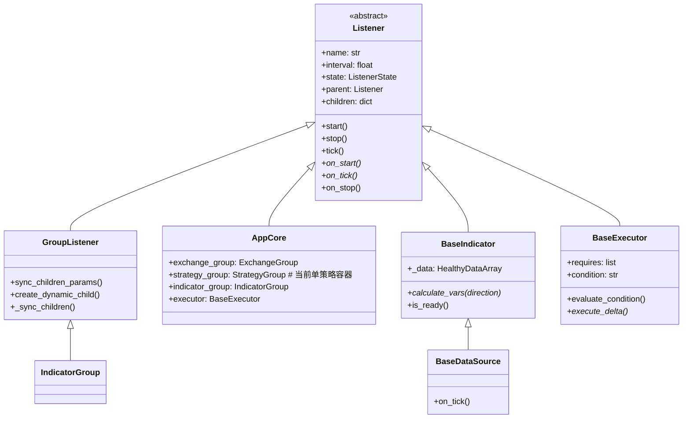
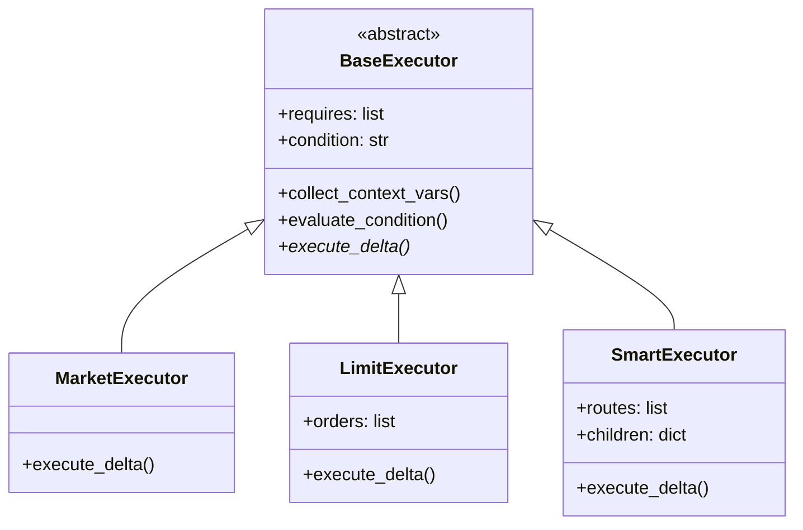
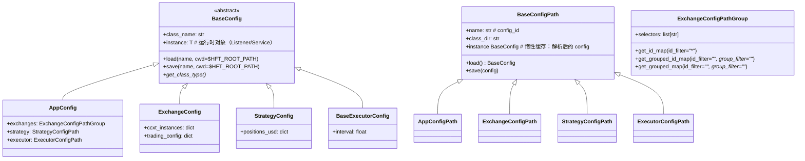

# HFT-Python 架构文档

## 项目概述

HFT-Python 是一个高频交易框架，采用**数据驱动**的执行架构，基于 Listener 树形结构实现统一的生命周期管理。

### 核心设计理念

1. **Indicator 统一架构**：DataSource 是特殊的 Indicator，统一通过 `IndicatorGroup` 管理
2. **数据驱动执行**：Indicator 提供变量，Executor 通过表达式动态决策
3. **组合模式**：Strategy 定义目标 + Executor 定义执行方式，自由组合
4. **Scope 系统**：分层变量作用域，支持层级化的数据流和聚合计算

## 性能特性（测试归纳）

以下结论来自性能回归测试的归纳，用于说明规模 N (交易对数量) 与窗口 W (秒) 下的复杂度趋势。测试覆盖 N∈{50, 200, 1000, 5000}，W≈300s。

- **请求复杂度：策略侧**  
  当策略只关注固定少量 symbol 时，watch 数量为常数 O(1)。  
  若 requires 包含按 symbol 扩展的数据源 (如 ticker/orderbook)，watch 数量与 symbol 数量线性增长 O(N)，应审慎评估配置。
- **请求复杂度：执行器侧**  
  Executor 仅处理策略输出的 targets，复杂度与 targets 数量 K 线性相关 O(K)，与市场总规模 N 解耦。  
  这意味着策略若已裁剪 targets，执行器侧必须保持常数级增长。
- **同类交易所去重**  
  同一 exchange_class 的 DataSource 订阅只落在一个主实例上，避免重复 watch。  
  不同 exchange_class 则各自独立订阅。
- **watch 释放**  
  DataSource stop 后必须取消对应 watch，确保 active watch 数量回落为 0。
- **内存上界：HealthyDataArray**  
  缓存大小受时间窗口 W 限制，上界约为采样频率 r 的 O(r * W)。  
  该结构不应随时间无限增长。

### 测试设计摘要

- 使用 Mock Exchange 统计 load/fetch/watch/unwatch 计数，衡量请求复杂度是否随 N 变化。
- 使用时间冻结工具加速窗口验证，确保 W=300s 下缓存上界不随时间膨胀。
- 对同一 exchange_class 的订阅只走主实例，避免重复 watch；不同 class 独立订阅。
- 对 watch 任务的 stop 进行回收验证，确保 active watch 数量能回到 0。

## 相关文档

| 文档 | 内容 |
|------|------|
| [listener.md](listener.md) | Listener 状态机、生命周期、GroupListener |
| [app-config.md](app-config.md) | App 配置字段与示例 |
| [config-path.md](config-path.md) | ConfigPath 类型、Exchange 选择器与缓存 |
| [scope.md](scope.md) | Scope 系统架构、层级体系、变量继承 |
| [vars.md](vars.md) | 变量系统设计、条件变量、表达式求值 |
| [scope-execution-flow.md](scope-execution-flow.md) | Scope 执行流程、计算顺序 |
| [executor.md](executor.md) | 执行器：Market、Limit、Smart、数据驱动设计 |
| [strategy.md](strategy.md) | 策略模块：目标仓位计算、Scope 集成 |
| [exchange.md](exchange.md) | 交易所封装、子监听器 |
| [datasource.md](datasource.md) | 数据源（特殊的 Indicator） |
| [indicator.md](indicator.md) | 指标模块：DataSource、Computed Indicator |
| [database.md](database.md) | ClickHouse 持久化 |
| [plugin.md](plugin.md) | 插件系统：Hooks、扩展点 |

## 核心模块

```
hft/
├── core/           # 核心模块
│   ├── listener.py     # Listener 基类和 GroupListener
│   ├── healthy_data.py # HealthyDataArray 健康数据管理
│   ├── scope/          # Scope 系统（Feature 0012）
│   │   ├── base.py         # BaseScope 基类
│   │   ├── manager.py      # ScopeManager 管理器
│   │   ├── scopes.py       # 标准 Scope 类型
│   │   └── vm.py           # VirtualMachine 表达式求值
│   └── app/            # 应用核心
│       ├── base.py         # AppCore 主应用
│       └── config.py       # 应用配置
│
├── config/         # 配置系统
│   ├── base.py         # BaseConfig 基类
│   └── crypto.py       # 加密工具
│
├── exchange/       # 交易所模块
│   ├── base.py         # BaseExchange 基类
│   ├── group.py        # ExchangeGroup 多账户管理
│   └── listeners.py    # 余额/持仓/订单监听器
│
├── strategy/       # 策略模块
│   ├── base.py         # BaseStrategy 基类
│   └── group.py        # StrategyGroup（当前仅管理单条 Strategy）
│
├── executor/       # 执行器模块
│   ├── base.py         # BaseExecutor 基类（数据驱动）
│   ├── market_executor/    # 市价单执行器
│   ├── limit_executor/     # 限价单执行器
│   └── smart_executor/     # 智能路由执行器
│
├── indicator/      # 指标模块（统一架构）
│   ├── base.py         # BaseIndicator, BaseDataSource
│   ├── group.py        # IndicatorGroup, TradingPairIndicators
│   ├── factory.py      # IndicatorFactory 注册表
│   ├── datasource/     # 数据源类 Indicator
│   │   ├── ticker_datasource.py
│   │   ├── orderbook_datasource.py
│   │   ├── trades_datasource.py
│   │   └── ohlcv_datasource.py
│   └── computed/       # 计算类 Indicator
│       ├── mid_price_indicator.py
│       ├── medal_edge_indicator.py
│       └── rsi_indicator.py
│
└── database/       # 数据库模块
    ├── client.py       # ClickHouse 客户端
    └── listeners.py    # DataListener 基类
```

## 类图

### Listener 继承体系



### 执行器继承体系



### 配置系统



## 数据流（数据驱动架构）

```
┌─────────────────────────────────────────────────────────────┐
│                    数据驱动执行流程                          │
├─────────────────────────────────────────────────────────────┤
│                                                             │
│  ┌─────────────┐                                            │
│  │  Exchange   │ ◄─── 市场数据 / 交易执行                   │
│  └──────┬──────┘                                            │
│         │                                                   │
│         ▼                                                   │
│  ┌─────────────────────────────────────────────────────┐   │
│  │  IndicatorGroup                                      │   │
│  │  ├── DataSource (ticker, trades, order_book)        │   │
│  │  └── Computed (rsi, medal_edge, volume)             │   │
│  └──────────────────────┬──────────────────────────────┘   │
│                         │                                   │
│                         ▼ calculate_vars(direction)         │
│  ┌─────────────────────────────────────────────────────┐   │
│  │  Context Variables                                   │   │
│  │  {direction, buy, sell, speed, notional,            │   │
│  │   mid_price, rsi, medal_edge, volume, ...}          │   │
│  └──────────────────────┬──────────────────────────────┘   │
│                         │                                   │
│         ┌───────────────┼───────────────┐                  │
│         ▼               ▼               ▼                  │
│  ┌───────────┐   ┌───────────┐   ┌───────────┐            │
│  │ Strategy  │   │ Executor  │   │ Executor  │            │
│  │ (目标仓位) │   │ condition │   │ 动态参数   │            │
│  └───────────┘   └───────────┘   └───────────┘            │
│                                                             │
└─────────────────────────────────────────────────────────────┘
```

## Listener 状态机

```
STOPPED ──start()──> STARTING ──tick()──> RUNNING
   ^                                         │
   │                                         │
   └────stop()────── STOPPING <──tick()──────┘
```

## 生命周期

1. **初始化**：AppCore 创建，加载配置，构建 Listener 树
2. **启动**：递归调用 `start()`，状态转为 STARTING
3. **运行**：循环调用 `tick()`，状态转为 RUNNING
4. **停止**：递归调用 `stop()`，状态转为 STOPPED

## 配置加载流程

```
$HFT_ROOT_PATH/conf/app/main.yaml
        │
        v
AppConfigPath("main").instance  # 解析出 AppConfig（Pydantic）
        │
        ├──> exchanges: ExchangeConfigPathGroup(selectors=[...])
        │         └──> get_id_map(...) -> {exchange_id: ExchangeConfigPath}
        │                 └──> ExchangeConfigPath.instance -> ExchangeConfig
        │
        ├──> strategy: StrategyConfigPath("static_positions/main")
        │         └──> StrategyConfigPath.instance -> StrategyConfig
        │
        ├──> executor: ExecutorConfigPath("market/default")
        │         └──> ExecutorConfigPath.instance -> ExecutorConfig
        │
        └──> indicators:  # 内联定义（运行时创建）
              ticker:
                class: TickerDataSource
                params: {window: 1m}
                ready_condition: "timeout < 5"
              └──> IndicatorFactory ──> BaseIndicator 实例
```

### 配置路径 vs 内联定义

| 组件 | 配置方式 | 原因 |
|------|----------|------|
| exchanges | 路径列表 | 配置复杂，可复用 |
| strategy | 单个路径 | 配置复杂，可复用 |
| executor | 单个路径 | 配置复杂，可复用 |
| indicators | 内联定义 | 配置简单，与交易对绑定 |

详见 [app-config.md](app-config.md)。

## Listener 恢复流程（与配置加载配合）

Listener 的持久化以“cache 字典”为中心（children 运行时重建）：

1. 读取 `AppConfigPath.instance` 得到唯一的 `AppConfig`
2. 若存在 pickle：加载得到 `cache`；否则 `cache = {}`
3. `app_core = get_or_create(cache, AppCore, "app/<name>")`
4. `app_core.config = app_config`
5. 启动后，由各 Listener 在 `on_start/on_tick` 内用 `get_or_create(cache, ...)` 重建 children

详见 [listener.md](listener.md)。
